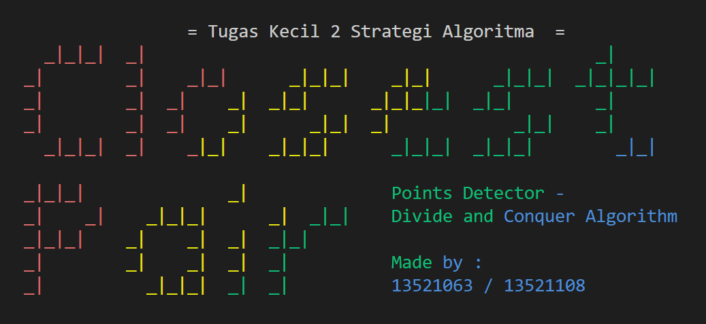

# Closest-Pair Points Problem
> *Source Code* ini dibuat untuk memenuhi Tugas Kecil 2- Strategi Algoritma IF2211 yaitu mengimplementasikan 
> "Mencari Pasangan Titik Terdekat 3D dengan Algoritma *Divide and Conquer*".

## Daftar Isi
* [Deskripsi Singkat Program](#deskripsi-singkat-program)
* [Sistematika File](#sistematika-file)
* [Requirements](#requirements)
* [Cara Menjalankan Program](#cara-menjalankan-program)
* [Project Status](#project-status)
* [Screenshots](#pscreenshots)
* [Author](#author)

## Deskripsi Singkat Program
Program untuk mencari solusi permasalahan pencarian pasangan titik dengan jarak terdekat dalam bidang dimensi 3 dengan Algoritma *Divide and Conquer*. Program membangkitkan pasangan titik secara acak. Kemudian program akan mengeluarkan hasil eksekusi berisi pasangan titik, waktu eksekusi, dan jumlah pemanggilan persamaan jarak euclidean yang digunakan. Adapun hasil tersebut akan dibandingkan dengan Algoritma *Brute Force* untuk memastikan kemangkusan dan kesangkilan program. Program dibangun dengan menggunakan bahasa Python.

## Sistematika File
```bash
.
├─── doc
|   ├─── Tucil2_13521063_13521108.pdf
|   └─── Result.txt
├─── src
|   ├─── BruteForce.py
|   ├─── DnC.py
|   ├─── Main.py
|   ├─── Point.py
|   └─── Visual.py
└─── README.md
```

## Requirements
* Python3 (versi 3.10.10 atau yang lebih baru)

## Cara Menjalankan Program
1. Pastikan Python3 versi terbaru sudah terpasang pada mesin eksekusi (Anda dapat mengecek versi Python3 dengan menjalankan *command* `python3 --version` pada *command prompt*).
2. Lakukan *clone repository* dengan command berikut
    ``` bash
    $ git clone https://github.com/mikeleo03/Tucil2_13521063_13521108.git
    ```
3. Masukkan perintah `python3 src/Main.py` ke dalam terminal untuk menjalankan program.
4. Anda diminta untuk memilih skema masukan, pilih untuk melakukan pemrosesan data titik pada tiga dimensi atau pada N dimensi.
5. Jika Anda memilih masukan tiga dimensi, maka Anda akan diminta untuk memberikan masukan berupa jumlah titik. Jika Anda memilih masukan N dimensi, maka selain jumlah titik, Anda juga akan diminta jumlah dimensi yang akan dianalisis.
6. Selanjutnya program akan secara otomatis melakukan pencarian pasangan titik terdekat dengan menggunakan Algoritma *Brute Force* dan Algoritma *Divide and Conquer*.
7. Setelah proses eksekusi selesai, Anda akan memperoleh statistik eksekusi berupa waktu eksekusi dan jumlah penggunaan persamaan jarak euclidean dilakukan dari kedua algoritma. Selain itu, untuk jumlah titik diatas 100, program akan langsung melakukan penyimpanan data titik pada *file* Result.txt

## Project Status
Status : *Completed*
| Poin  | Ya | Tidak |
|---|---|---|
| Program berhasil dikompilasi tanpa kesalahan | ✓ |   |
| Program berhasil *running* | ✓ |   |
| Program dapat menerima masukan dan menuliskan luaran | ✓ |   |
| Luaran program sudah benar (solusi *closest pair* benar) | ✓ |  |
| Bonus 1 dikerjakan | ✓ |  |
| Bonus 2 dikerjakan | ✓ |  |

## Screenshots


## Author
Nama : Michael Leon Putra Widhi </br>
NIM : 13521108 </br>
Program Studi : Teknik Informatika </br>
Profile Github : [mikeleo03](https://github.com/mikeleo03)

Nama : Salomo Reinhart Gregory Manalu </br>
NIM : 13521063 </br>
Program Studi : Teknik Informatika </br>
Profile Github : [Salomo309](https://github.com/Salomo309)